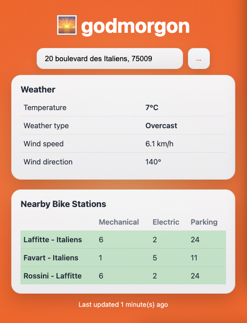

# Godmorgon

Godmorgon (Swedish for: good morning) a microservices-based API to help me decide whether to bike or take the subway to work based on weather conditions and bike station availability.

<p align="center">
  
</p>

## Architecture

The project consists of three main components:

- **API Gateway** (port 8000): Routes requests and aggregates responses from microservices
- **Weather Microservice** (port 8001): Fetches and processes weather data
- **Bikes Microservice** (port 8002): Retrieves nearest bike stations and availability data

## Stack

FastAPI, Python 3.10+ (httpx, requests, NumPy, Pandas, Pydanctic)


## Installation

### 1. Clone the repository

```bash
git clone https://github.com/SK8gh/godmorgon.git
```

### 2. Install dependencies

```bash
pip install -r requirements.txt
```

### 3. Configure settings

Edit `configuration.py` to set your preferences:

```python
# Service ports
SERVICES = {
    'gateway': {'port': 8000, 'name': 'application-gateway'},
    'microservices': {
        'weather': {'port': 8001, 'name': 'weather-microservice', 'timeout': 5.0},
        'bikes': {'port': 8002, 'name': 'bikes-microservice', 'timeout': 5.0}
    }
}

# Logging
ENABLE_LOGS_PURGE = True  # Set to False to keep old logs
LOG_LEVEL = logging.INFO
```

## Running the API Locally

```bash
python application.py
```

This will start:
- Gateway on `http://0.0.0.0:8000`
- Weather microservice on `http://0.0.0.0:8001`
- Bikes microservice on `http://0.0.0.0:8002`

## Testing the API

### Using curl

```bash
# Health check
curl http://127.0.0.1:8000/health

# Get dashboard data
curl "http://127.0.0.1:8000/get_dashboard_data?address=1%20rue%20de%20Charonne,%2075011"

# Get weather only
curl "http://127.0.0.1:8001/get_weather_info?address=Paris"

# Get bike stations only
curl "http://127.0.0.1:8002/get_address_nearest_stations?address=Paris"
```

### Using the interactive API documentation

Once the services are running, visit:

- Gateway: `http://127.0.0.1:8000/docs`
- Weather service: `http://127.0.0.1:8001/docs`
- Bikes service: `http://127.0.0.1:8002/docs`

## Weather Codes

The API uses WMO (World Meteorological Organization) weather codes:

- 0-3: Clear to overcast
- 45-48: Fog
- 51-67: Drizzle and rain
- 71-77: Snow
- 80-82: Rain showers
- 85-86: Snow showers
- 95-99: Thunderstorms

## License

This project is open source and available under the MIT License.
